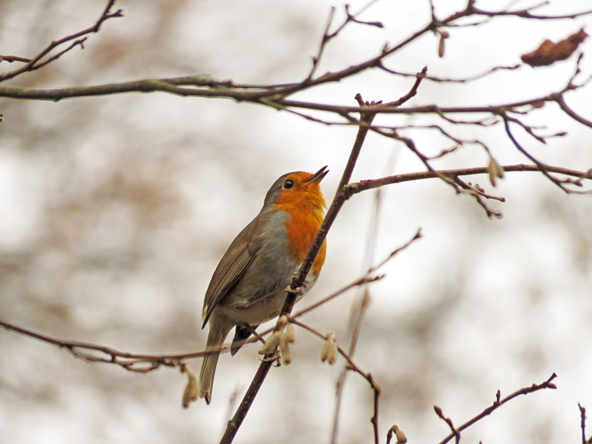
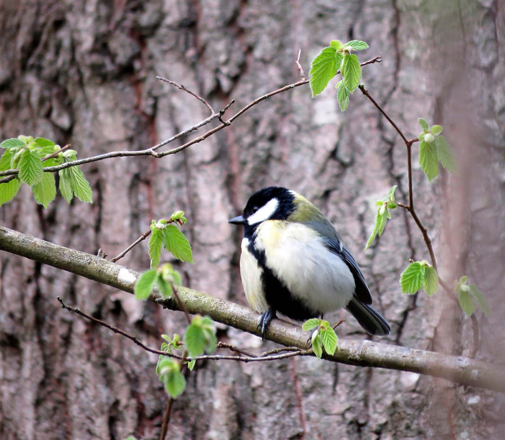
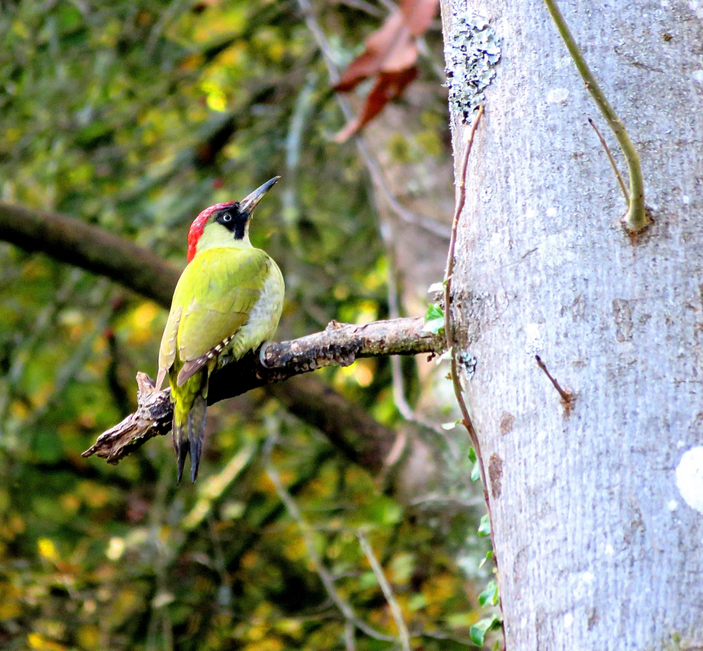
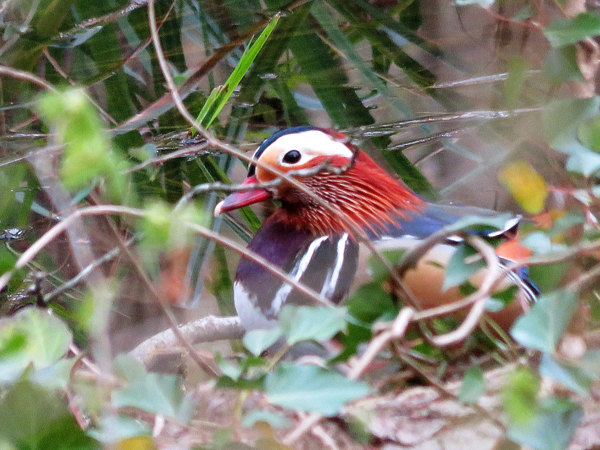
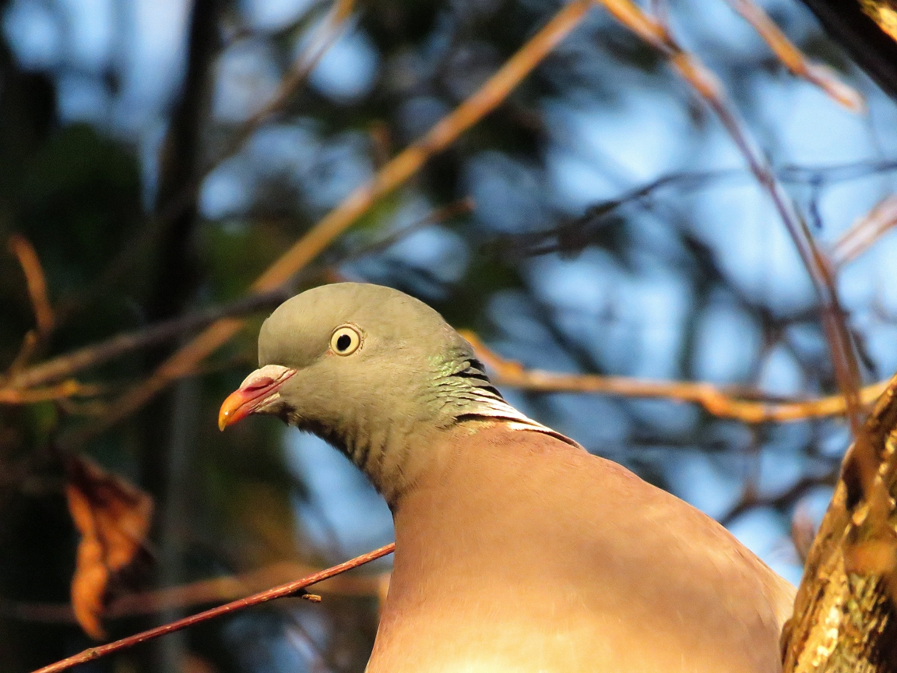

# There are many species of birds in the woods, often travelling between the woods and surrounding gardens and fields.

Singing beligerant songs of terratorial threat.

Greater that a Blue tit.

A large woodpecker, feeds on the ground, likes ants.

Feeds on Insects, seeds and nuts. Our bushcam often catches one searching tree stumps.

Sometimes more ornamental species visit the woodland ponds.

A very common pigeon with a distinctive coo-COOOO-coo-coo call.
