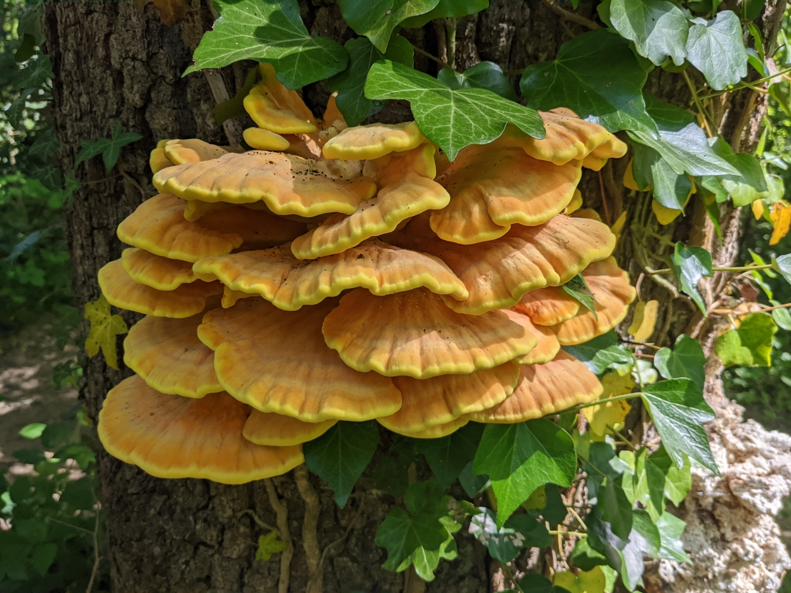
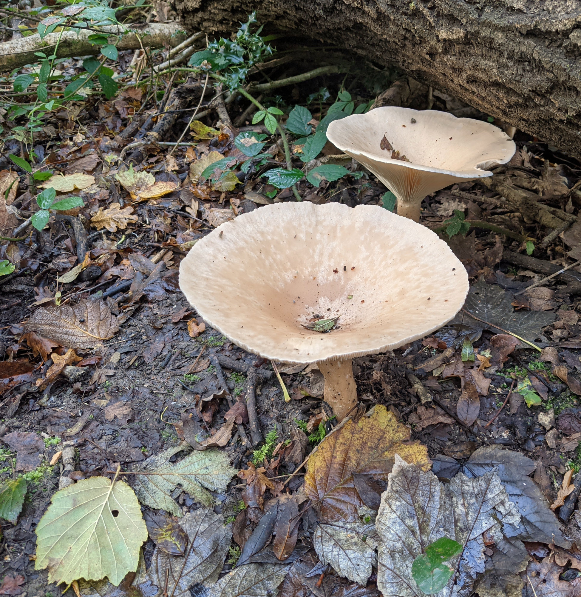

# There are hundreds of species of fungi in the woods, here are some of them...

Doesn't look like chicken, but please leave these for other to enjoy.

Forms lines and arcs of large brown fruiting bodies in the Autumn.

Good examples can be found along Pegasus path.

Species in this genus can be difficult to identify. 