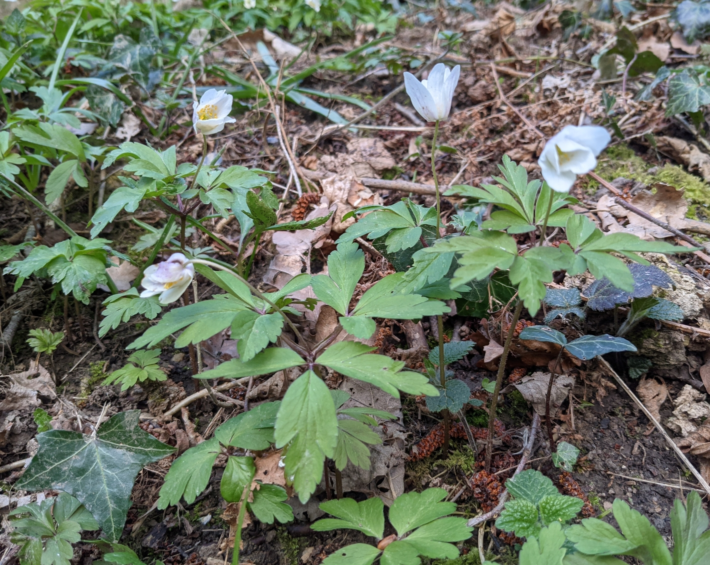
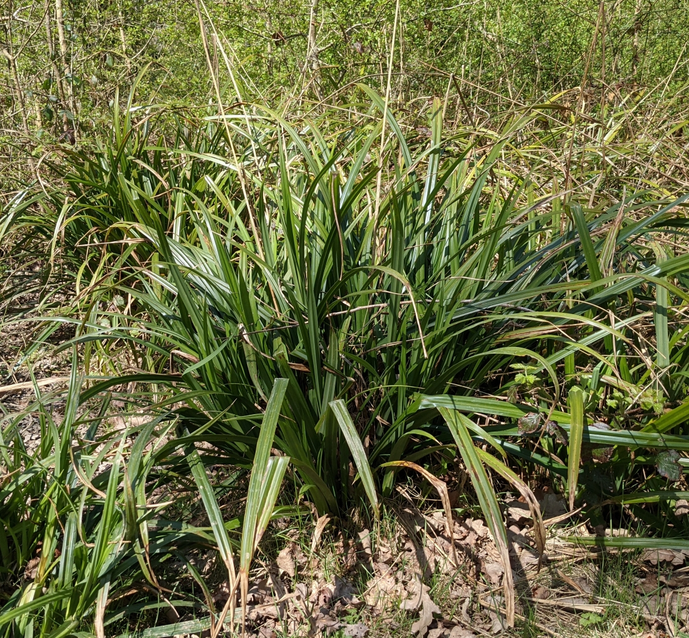
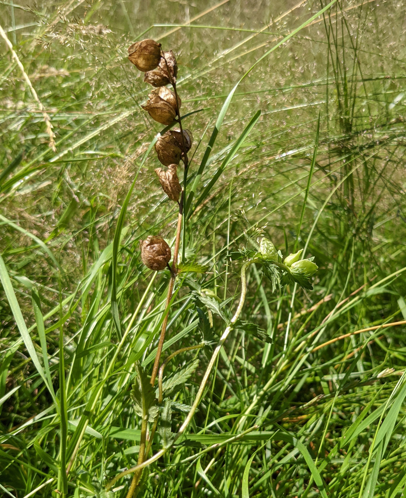
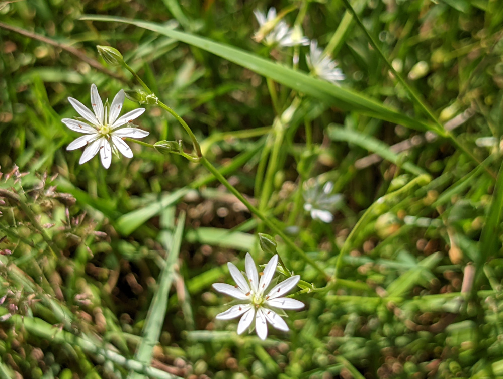
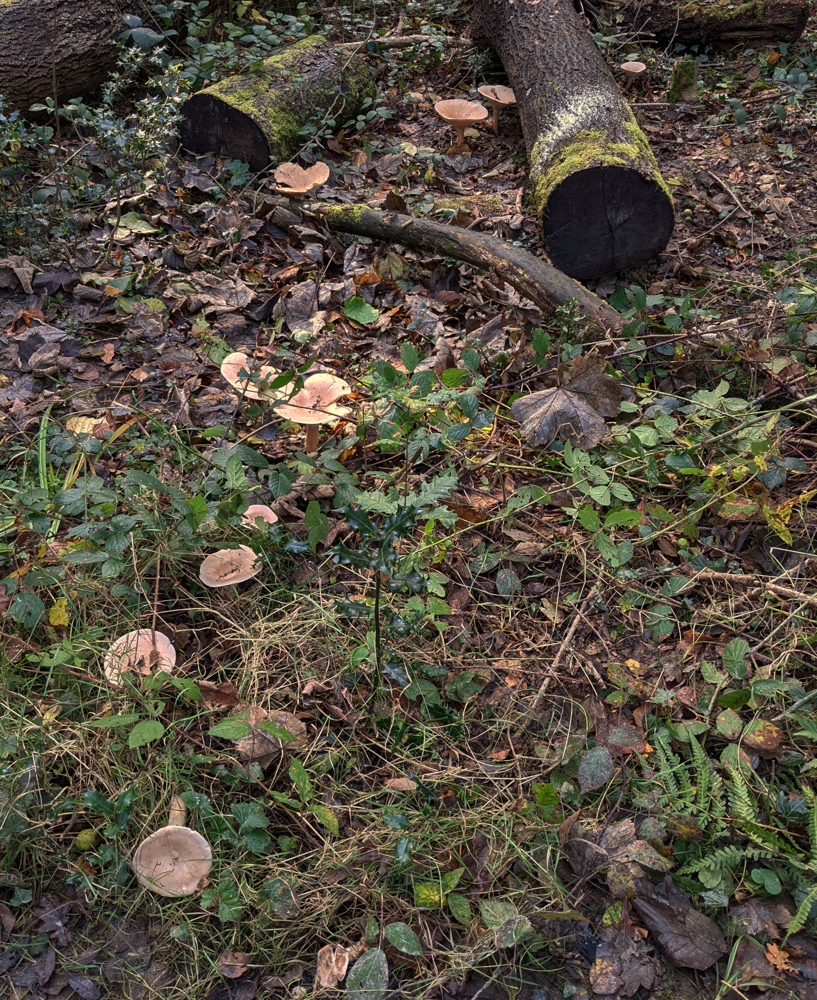

# Common Species

Try the [species gallery](Common)

### Lesser Celendine
<figure>
 
 <figcaption>Lesser Celendine</figcaption>
</figure>

Flowering in April with distinctive yellow flowers. This plant is often found beside paths, where it finds the dappled shade it preferrs.

### Wood Anemone

<figure>
 
 <figcaption>Wood Anemone</figcaption>
</figure>

Another spring flower, favouring woodland paths.

#### Pendulous Sedge
<figure>
 
 <figcaption>Pendulous Sedge</figcaption>
</figure>
 
Find this plant whereever there are damp areas, often growing on seep lines where a pourous sandstone cap meets impervious clay. 

Growing all year round, its seed heads droop to one side.

### Yellow Rattle

<figure>
 
 <figcaption>Yellow Rattle</figcaption>
</figure>
 
Find this plant in the meadow. It parasitises grass, supressing it growth and helps other wildflowers compete.

### Lesser Stitchwort

<figure>
 
 <figcaption>Lesser Stitchwort</figcaption>
</figure>
 
Find this plant in the meadow. It is a tiny flower, but covers the meadow throuout the summer. Have a close look at the flower, what appears to be ten petals is actually five. 

### Trooping Funnel

<figure>
 
 <figcaption>Trooping Funnel Line</figcaption>
</figure><figure>
 
 <figcaption>Trooping Funnel</figcaption>
</figure>
Trooping Funnel appears beside paths in the autumn. It forms rings and arcs of large funnels.

# Meadow Survey

A survey in Rutland Meadow found these species.

<table  style="border-style: none;">
<tr><th>Binomial Name</th><th>Common Name</th></tr>
    
<tr><td>  Lolium </td><td> Rye Grass</td> </tr>    
<tr><td>  Poa Trivialis </td><td> Rough Stalked Meadow Grass</td> </tr>    
<tr><td>  Holcus Lanatus </td><td> yorkshire fog</td> </tr>    
<tr><td>  Rumex Acetosa </td><td> common sorrel</td> </tr>    
<tr><td>  Rumex Obtus fozia </td><td> broad leaved dock</td> </tr>    
<tr><td>  Dactylis Glomerata </td><td> Cock’s foot grass</td> </tr>    
<tr><td>  Ranunculus repens </td><td> creeping buttercup</td> </tr>    
<tr><td>  Chorthippus parallelus </td><td> meadow grasshopper</td> </tr>    
<tr><td>  Rhinanthus sp. </td><td> yellow rattle</td> </tr>    
<tr><td>  Centaurea nigra </td><td> common knapweed</td> </tr>    
<tr><td>  Stellaria graminea </td><td> lesser stitchwort</td> </tr>    
<tr><td>  Arrhenatherum elatius </td><td> false oat grass</td> </tr>    
<tr><td>  Hyacinthoides non-scripta</td><td> common bluebell</td> </tr>    
<tr><td> </td><td> bracken</td> </tr>    
<tr><td>  Prunella vulgaris </td><td> self heal</td> </tr>    
<tr><td> </td><td> common spotted orchid</td> </tr>    
<tr><td> </td><td> common blue butterfly</td> </tr>    
<tr><td>  Trifolium pratense </td><td> red clover</td> </tr>    
<tr><td>  Plantago lanceolata </td><td> ribwort plantain</td> </tr>    
<tr><td>  Cirsium palustre </td><td> marsh thistle</td> </tr>    
<tr><td>  Hypochaeris </td><td> cat’s ears</td> </tr>    
<tr><td>  Angelica sylvestris</td><td> wild angelica</td> </tr>    
<tr><td>  Leucanthemum </td><td> oxeye daisy</td> </tr>    
<tr><td>  Senecio jacobaea </td><td> ragwort</td> </tr>    
<tr><td>  Agrostis capillaris </td><td> common bent</td> </tr>    
<tr><td>  Trifolium repens </td><td> white clover</td> </tr>    
<tr><td>  Ranunculus acris </td><td> meadow buttercup</td> </tr>    
<tr><td>  Anthoxanthum odoratum </td><td> sweet vernal grass</td> </tr>    
<tr><td>  Cynosurus cristantus </td><td> creste dogstail</td> </tr>    
<tr><td>  Lotus corniculatus </td><td> birds foot trefoil</td> </tr>    
<tr><td>  Lotus uliginosus </td><td> marsh birds foot trefoil</td> </tr>    
<tr><td>  Luzula campestris </td><td> field wood rush</td> </tr>    
<tr><td>  Cerastium </td><td> Mouse-ear chickweed</td> </tr>    
<tr><td>  Lasius flavus </td><td> yellow meadow ant</td> </tr>    
<tr><td>  Festuca rubra </td><td> red fescue</td> </tr>    
<tr><td>  Potentilla erecta </td><td> tormentil</td> </tr> 
</table>