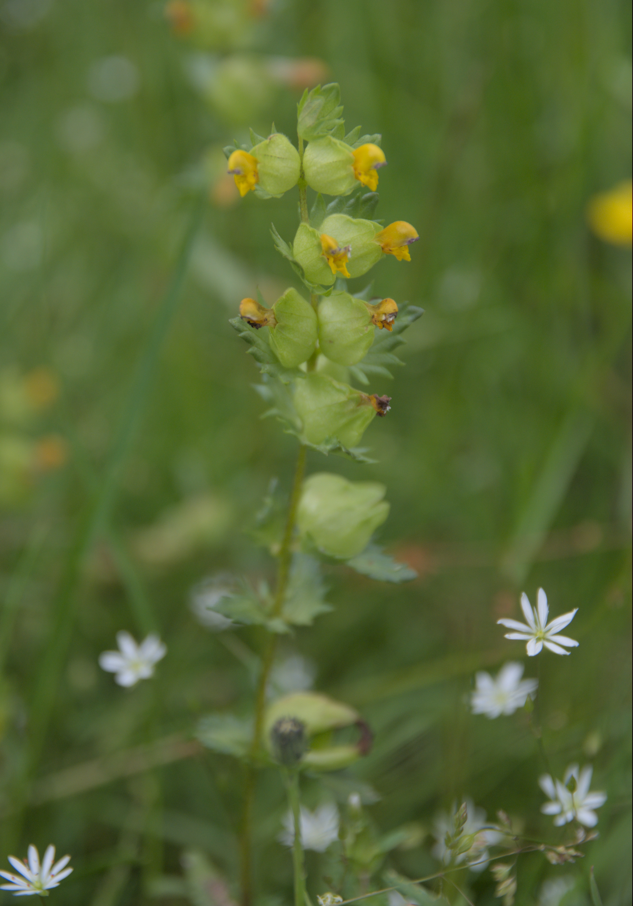
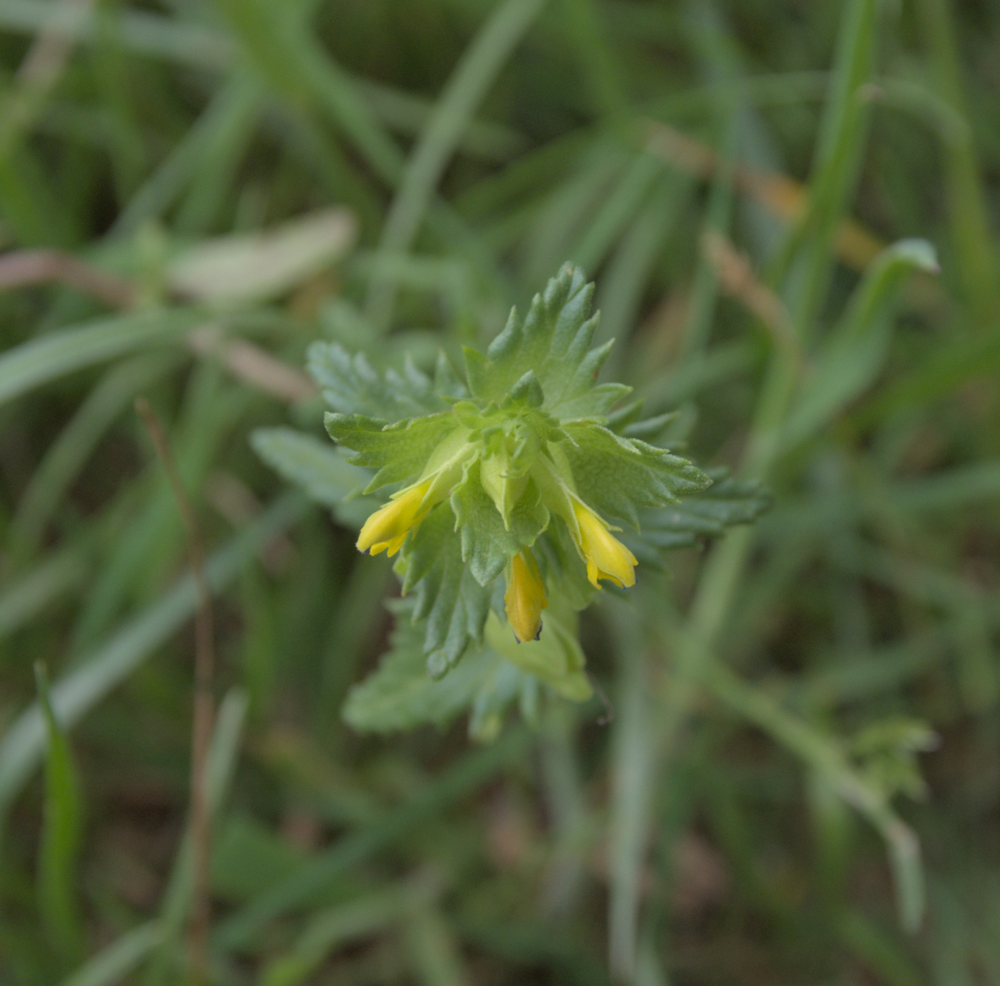
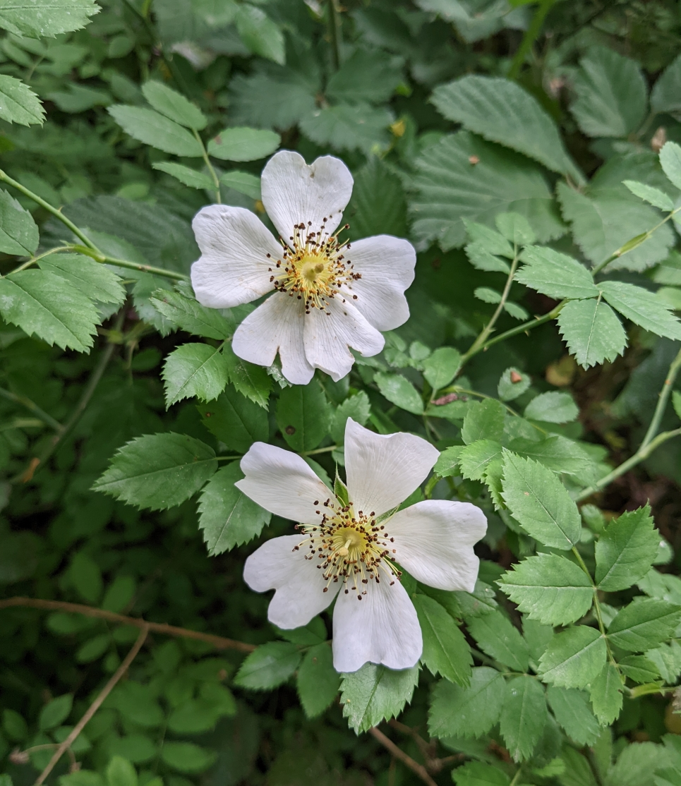

Try the galleries for [common species](Common) and some [harder to find](Other) species.

Or see our lists of [species identified in previous surveys](Species_List)

### Lesser Celendine
<figure>
 
 <figcaption>Lesser Celendine</figcaption>
</figure>

Flowering in April with distinctive yellow flowers. This plant is often found beside paths, where it finds the dappled shade it preferrs.

### Wood Anemone

<figure>
 
 <figcaption>Wood Anemone</figcaption>
</figure>

Another spring flower, favouring woodland paths.

#### Pendulous Sedge
<figure>
 
 <figcaption>Pendulous Sedge</figcaption>
</figure>
 
Find this plant whereever there are damp areas, often growing on seep lines where a pourous sandstone cap meets impervious clay. 

Growing all year round, its seed heads droop to one side.

### Yellow Rattle

<figure>
 
 <figcaption>Yellow Rattle Seedhead</figcaption>
</figure>
<figure>
 
 <figcaption>Yellow Rattle amongst Stitchwort</figcaption>
</figure>
 <figure>
 
 <figcaption>Yellow Rattle</figcaption>
</figure>
 
Find this plant in June in the meadow. It parasitises grass, supressing grass growth and helping other wildflowers compete.

### Lesser Stitchwort

<figure>
 
 <figcaption>Lesser Stitchwort</figcaption>
</figure>
 
Find this plant in the meadow. It is a tiny flower, but covers the meadow throughout the summer. Have a close look at the flower, what appears to be ten petals is actually five. 

### Trooping Funnel

<figure>
 
 <figcaption>Trooping Funnel Line</figcaption>
</figure><figure>
 
 <figcaption>Trooping Funnel</figcaption>
</figure>
Trooping Funnel appears beside paths in the autumn. It forms rings and arcs of large funnels.

### Dog Rose

<figure>
 
 <figcaption>Dog Rose against Bramble</figcaption>
</figure>
Find this in June, Look for 4cm wide flowers in brambles along side the paths.