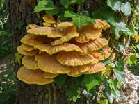

# Galleries

See our lists of [species identified in previous surveys](Species_List)

 Common Species

 Insects and Spiders

 Birds

 Fungi

 Plants

# Some Common Species

<figure>
 
 <figcaption>Lesser Celendine</figcaption>
</figure>
Flowering in April with distinctive yellow flowers. Lesser Celendine is often found beside paths, where it finds the dappled shade it preferrs.

<figure>
 
 <figcaption>Wood Anemone</figcaption>
</figure>
Another spring flower, favouring woodland paths.

<figure>
 
 <figcaption>Pendulous Sedge</figcaption>
</figure>
Find this Sedge wherever there are damp areas, often growing on seep lines where a pourous sandstone cap meets impervious clay. 

Growing all year round, its seed heads droop to one side. Be carefull if pulling on its leaves, they can cut the skin!

<figure>
 
 <figcaption>Yellow Rattle</figcaption>
</figure>
Find Yellow Rattle in the meadow during late summer. It parasitises grass, supressing grass growth and helping other wildflowers compete.

<figure>
 
 <figcaption>Lesser Stitchwort</figcaption>
</figure>
Find this delicate flower in the meadow. The tiny flowers cover the meadow throughout the summer. Have a close look at the flower, what appears to be ten petals is actually five. 

<figure>
 
 <figcaption>Trooping Funnel Line</figcaption>
</figure><figure>
 
 <figcaption>Trooping Funnel</figcaption>
</figure>
Trooping Funnel appears beside paths in the autumn. It forms rings and arcs of large funnels.

<figure>
 
 <figcaption>Dog Rose against Bramble</figcaption>
</figure>
Find this in June, Look for 4cm wide flowers in brambles along side the paths.