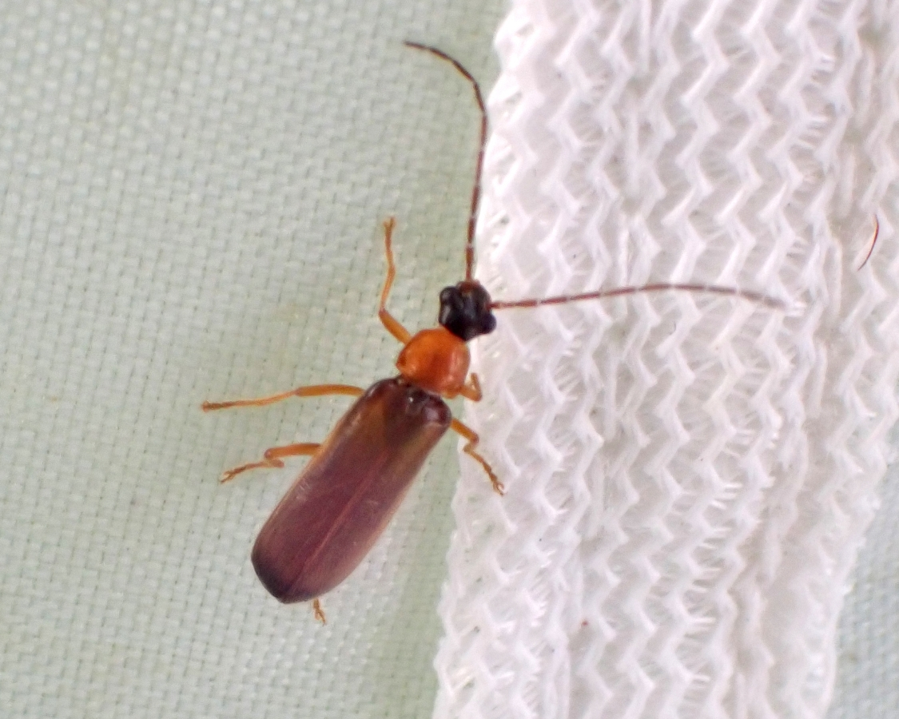
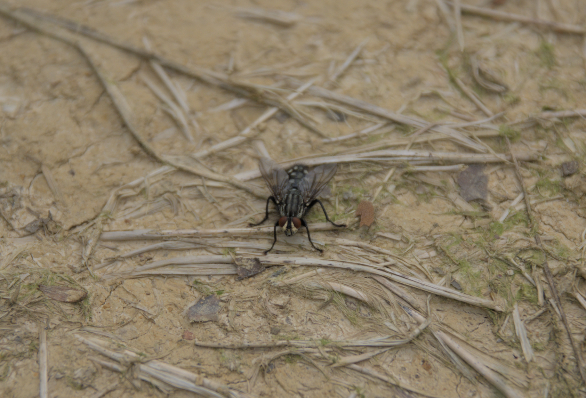
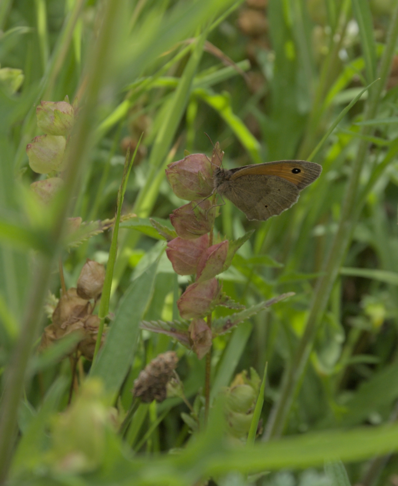
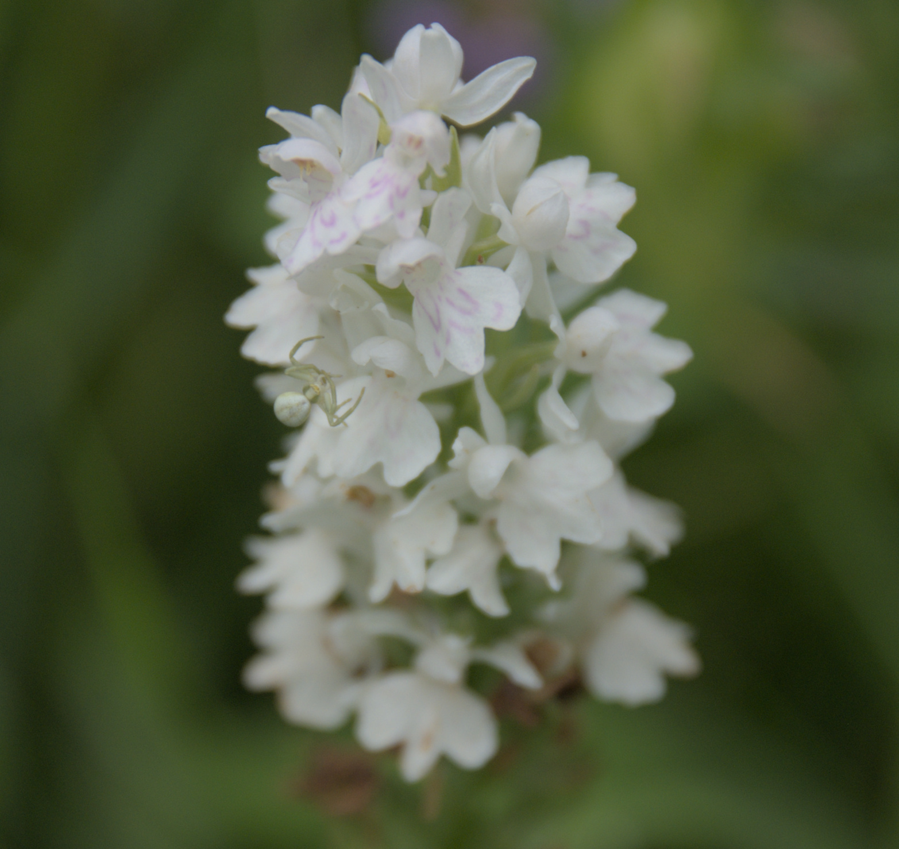
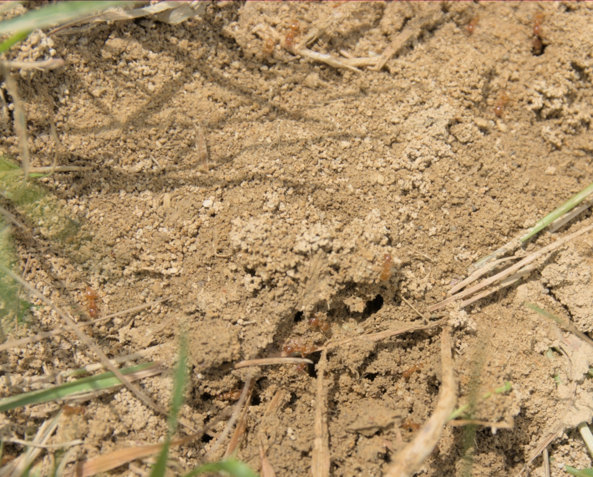
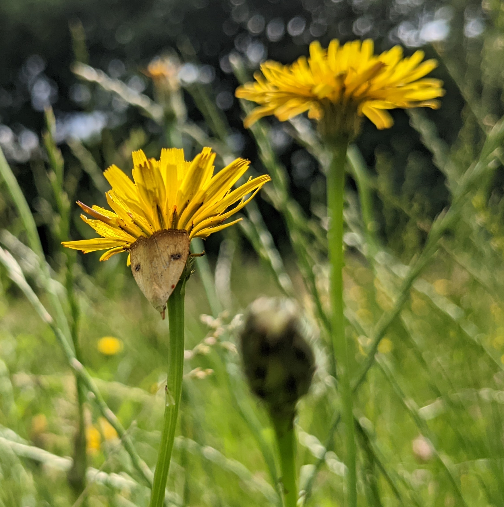

# The woods are full of small insects and other invertebrates, here is just a small selection.

A soldier beetle. These beetles hunt small insects in woodland edges.

Uses dead animals to host its eggs. Often seen in open areas in the sun.

These butterflies will gather in the meadow in June and July. 

If you look carefully on flower heads, you may find a carefully hidden spider. They lie in wait for flies and bees.

These ands are responsible for small bare patches in the meadow.

Many moths visit the woods and meadow.
