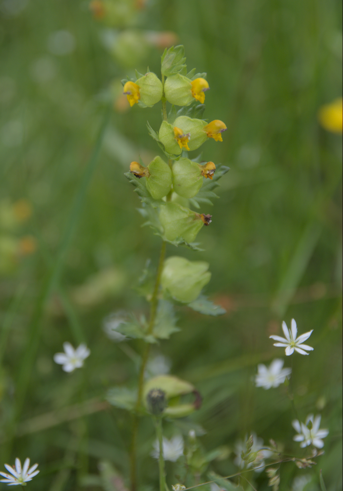

# These are common species you can find in the woods

Flowering in April with distinctive yellow flowers. This plant is often found beside paths, where it finds the dappled shade it preferrs.

Another spring flower, favouring woodland paths.

Find this plant whereever there are damp areas, often growing on seep lines where a pourous sandstone cap meets impervious clay.
Growing all year round, its seed heads droop to one side.

Another spring flower, favouring woodland paths.
Find this plant in the meadow. It parasitises grass, supressing it growth and helps other wildflowers compete.

Find this plant in the meadow. It is a tiny flower, but covers the meadow throuout the summer. Have a close look at the flower, what appears to be ten petals is actually five.